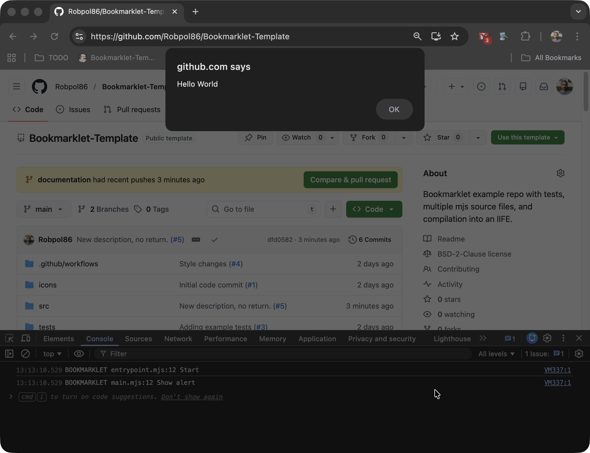
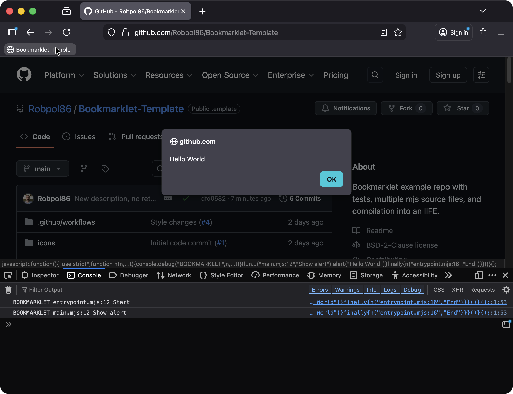
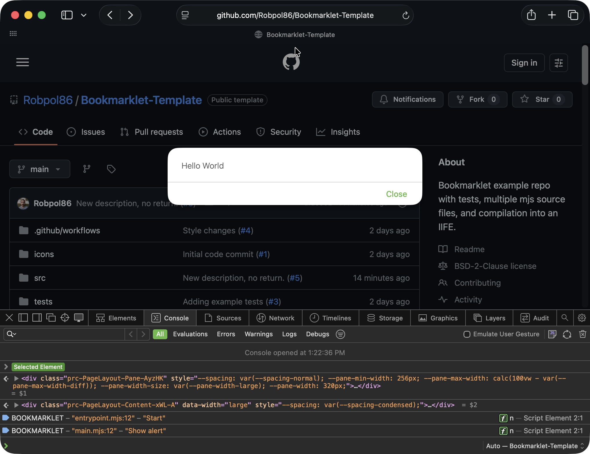
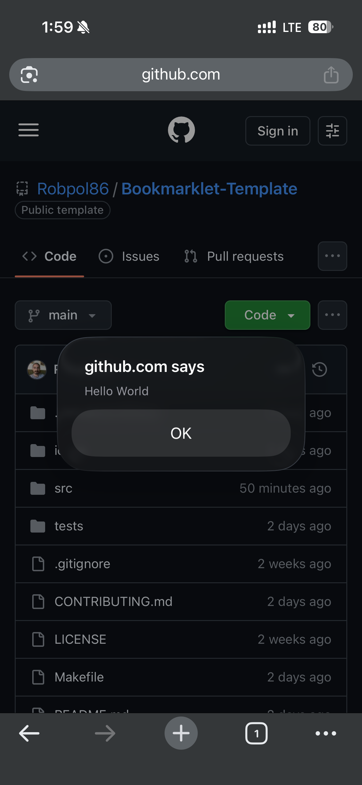
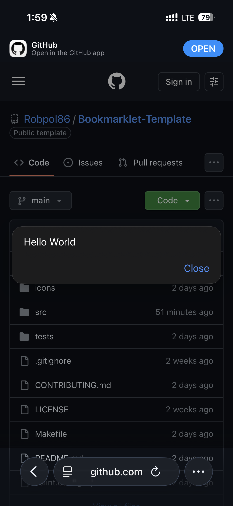
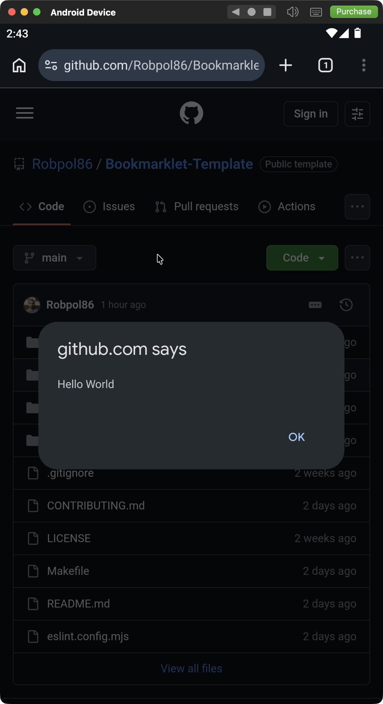
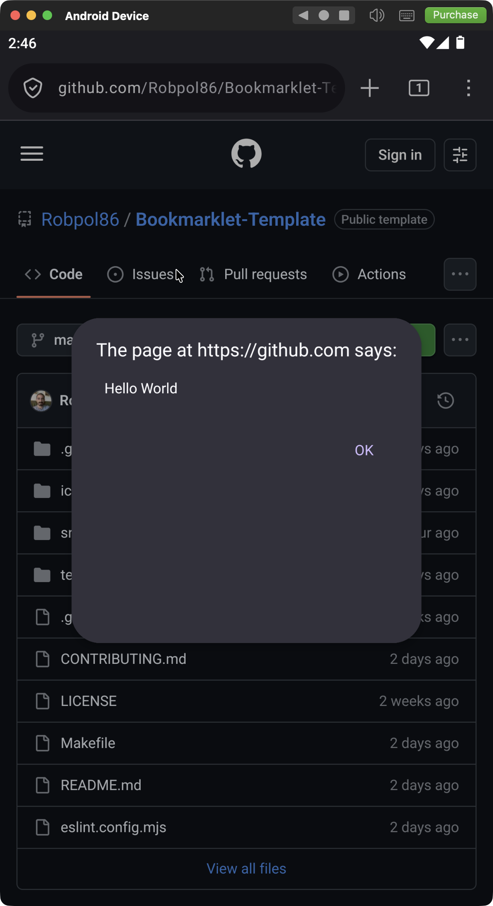

#  Bookmarklet Template

Bookmarklet example repo with tests, multiple mjs source files, and compilation into an IIFE.

<table>
    <tr>
        <td>
            

                
                <em>An elephant at sunset</em>
            

        </td>
        <td></td>
    </tr>
    <tr>
        <td></td>
        <td></td>
    </tr>
    <tr>
        <td></td>
        <td></td>
    </tr>
    <tr>
        <td></td>
        <td></td>
    </tr>
</table>

## Install

There are three ways to install the bookmarklet.

### Import Bookmarks HTML Method

The best way to install this bookmarklet for **Chrome** and **Edge** is to import the bookmarks HTML file. This way the
bookmarklet will have a favicon. Unfortunately the favicon doesn't show in other browsers.

1. Download the latest `bookmarklet.html` from the [releases section](https://github.com/Robpol86/bookmarklet-template/releases)
1. Import in Chrome:
    1. In Chrome go to Bookmarks > Bookmark Manager
    1. Click on the three dots in the upper right corner and click "Import bookmarks"
    1. Select the downloaded `bookmarklet.html`
    1. You'll see a new folder "Imported" in your bookmarks bar with the bookmarklet inside
1. Import in Firefox:
    1. In Firefox go to Bookmarks > Manage Bookmarks
    1. In the Library window click on the import/backup button (up and down arrows) then Import Bookmarks from HTML
    1. Select the downloaded `bookmarklet.html`
    1. Locate **Bookmarklet-Template** in the Bookmarks Menu folder
1. Import in Safari:
    1. In Safari go to File > Import Browsing Data from File or Folder > Choose File or Folder
    1. Select the downloaded `bookmarklet.html`
    1. Locate **Bookmarklet-Template** in your bookmarks

### Copy and Paste Method

This method doesn't require importing, you just copy and paste the javascript "URL" into a new bookmark manually.

1. Download the latest `bookmarklet.js` from the [releases section](https://github.com/Robpol86/bookmarklet-template/releases)
1. Copy the contents of `bookmarklet.js` to your clipboard
1. In Chrome:
    1. In Chrome go to Bookmarks > Bookmark Manager
    1. Click on the three dots in the upper right corner and click "Add new bookmark"
    1. Type **Bookmarklet-Template** for the name and paste the contents of `bookmarklet.js` into the URL field
1. In Firefox:
    1. In Firefox go to Bookmarks > Manage Bookmarks
    1. In the Library window click on the organize button (gear icon) then click "Add Bookmark"
    1. Type **Bookmarklet-Template** for the name and paste the contents of `bookmarklet.js` into the URL field

### Drag and Drop Method

*This method doesn't work from a GitHub readme.*

## Usage

Go to any website and click on the bookmarklet in the bookmarks bar (or wherever you've placed it). You should get an alert
that says "Hello World".
